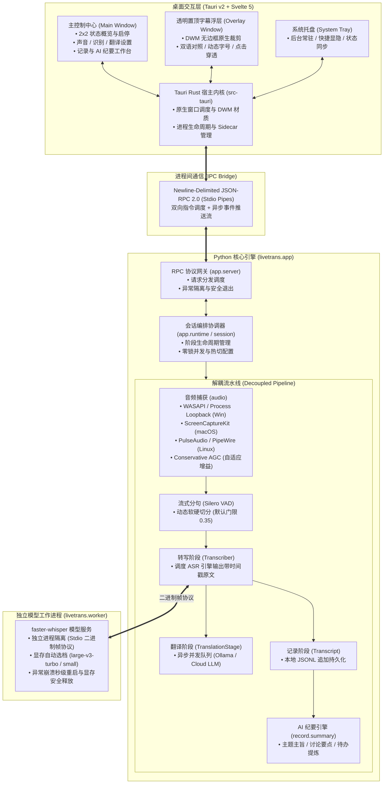

# LiveTrans

[](LICENSE)
[](https://www.python.org/)
[](https://tauri.app/)
[](https://svelte.dev/)

LiveTrans 是一款专为**外语直播、视频生肉、跨国网课及线上会议**打造的高性能实时语音转写、双语同传与 AI 会议纪要桌面应用。

通过系统音频捕获与流式 VAD 分句，将演讲者语音实时转写为双语悬浮字幕，并提供全链路解耦的会话存盘与大模型智能纪要提炼。

---

## 🌟 核心特性

- ⚡ **轻量自包含架构**：全面重构至 **Tauri v2 + Svelte 5**，告别传统 Python 桌面框架的庞大体积与高内存占用，响应灵敏迅速。
- 🎨 **现代化纯平面设计 (Flat Design)**：移除臃肿高光、拟物伪元素与全屏模糊光斑，改用纯扁平色块、1px 细微边界线与几何同心圆角（`--lt-radius-*`）；由 Windows 11 DWM 统一接管原生窗口圆角裁剪，彻底杜绝双重圆角冲突。
- 🔀 **四大运行模式自由解耦**：
  - **模式 1（边翻译边记录）**：实时同传双语字幕 + 本地逐句对照存盘；
  - **模式 2（仅实时翻译）**：看直播与生肉视频，实时字幕上屏，零磁盘垃圾；
  - **模式 3（仅语音记录 / 会议速记）**：会议听写与整理，0 外部 API 调用、0 Token 消耗，字幕显示大字号原文；
  - **模式 4（纯原文字幕）**：纯粹作为高灵敏度实时语音听写字幕器。
  - *支持在运行中一键无缝热切，无需重启识别引擎。*
- 📋 **AI 智能会议纪要与总结**：
  - 复用配置的翻译模型接口，一键提炼生成：**主题与核心主旨**、**多议题重点讨论**、**关键结论**与 **Action Items 待办项**；
  - 支持「完整会议纪要」与「极简速览（<200字）」双模式切换；
  - 提供独立「记录与纪要」工作台，支持时间戳双语对照浏览、一键复制与格式化 Markdown 文件导出。
- 🎙️ **多平台音频捕获与保守型 AGC**：
  - **Windows**：WASAPI 系统环回（整个系统声音）或 Process Loopback（仅捕获指定软件声音，建议 Windows 11 / Build 20348+）；
  - **macOS**：原生 ScreenCaptureKit 音频捕获；
  - **Linux**：PulseAudio / PipeWire 输出设备监听源；
  - **保守型自适应增益 (Conservative AGC)**：筑牢底噪门限冻结（<-60 dBFS 静音不放大）、快降慢升防抽吸、最大 6x 增益硬顶与软限幅防护，弱音切出率提升至 100%。
- 🛡️ **双进程模型隔离**：faster-whisper 本地模型在独立的子进程中运行，通过标准输入输出二进制帧协议通信。模型意外故障不影响主窗口，退出后显存瞬间释放。

---

## 🏛️ 项目系统架构

LiveTrans 采用**三层异构多进程架构**：前端桌面壳体（Rust / Webview）、计算调度中枢（Python Sidecar）与推理工作进程（Model Worker）分层协作。



---

## 🗂️ 目录结构

```
live-trans/
├── desktop/                       # Tauri v2 桌面客户端
│   ├── src/                       # Svelte 5 前端工程
│   │   ├── main/                  # 主控制中心 (概览、音频、ASR、翻译、记录、外观)
│   │   ├── subtitle/              # 置顶悬浮双语字幕浮层
│   │   ├── lib/                   # 状态管理、主题色生成与 JSON-RPC 桥接
│   │   └── assets/                # 应用图标与矢量静态资源
│   ├── src-tauri/                 # Tauri Rust 原生宿主
│   │   ├── src/main.rs            # 窗口创建、系统托盘、Windows 11 DWM 控制
│   │   ├── src/core.rs            # Python Sidecar 进程生命周期与管道通信
│   │   ├── Cargo.toml             # Rust 依赖清单
│   │   └── tauri.conf.json        # Tauri 窗口与安全权限配置
│   └── package.json               # 前端依赖配置
│
├── livetrans/                     # Python 核心计算中枢
│   ├── app/                       # RPC 服务端、控制器与运行时协调
│   │   ├── server.py              # Newline-Delimited JSON-RPC 2.0 服务端
│   │   ├── controller.py          # 应用状态与设置操作分发
│   │   ├── runtime.py             # 会话生命周期与串行异步状态机
│   │   └── records.py             # 记录存盘与历史管理服务
│   ├── audio/                     # 跨平台系统音频环回与捕获
│   │   ├── windows/               # WASAPI 与 Process Loopback API (Windows)
│   │   ├── macos.py               # ScreenCaptureKit (macOS)
│   │   ├── linux.py               # PulseAudio / PipeWire (Linux)
│   │   └── vad.py                 # Silero VAD 动态流式分句与 Conservative AGC
│   ├── asr/                       # 语音识别抽象与本地/云端客户端
│   ├── translate/                 # 实时翻译抽象、并发队列与 OpenAI 兼容适配
│   ├── record/                    # 会话持久化与 AI 会议纪要生成引擎
│   ├── worker/                    # 独立 Whisper 模型运行时与进程帧协议
│   ├── session.py                 # 阶段串联与事件调度装配
│   ├── transcriber.py             # 声音采集 → VAD → ASR 解耦流水线
│   └── config.py                  # 配置模型与原子保存
│
├── scripts/                       # 辅助诊断与开发排查工具
├── tests/                         # 自动化单元测试套件
├── packaging/                     # 发行依赖锁定与安装打包脚本
├── start.bat                      # Windows 一键编译并启动脚本
└── pyproject.toml                 # Python 项目元数据与依赖定义
```

---

## 🚀 快速上手

### 1. 环境准备

| 组件 | 版本要求 | 用途 |
|---|---|---|
| **Python** | 3.10+ | 核心音频捕获、ASR 与翻译引擎 |
| **Rust / Cargo** | 1.85+ | 编译 Tauri 桌面端宿主（`livetrans.exe`） |
| **Node.js** | 18+ | 构建 Svelte 5 前端资源 |

### 2. 克隆仓库与配置 Python 环境

```powershell
# 1. 克隆代码仓库
git clone https://github.com/MisterRabbit0w0/live-trans.git
cd live-trans

# 2. 创建并激活虚拟环境
python -m venv .venv
.venv\Scripts\activate

# 3. 安装依赖
# 有 NVIDIA 独立显卡（推荐，支持 CUDA 硬件加速）：
pip install -e ".[cuda]"

# 仅使用 CPU 或纯云端 API：
pip install -e .
```

### 3. 编译并启动

- **一键运行（推荐）**：  
  直接双击根目录的 **`start.bat`**。  
  *脚本会自动检测环境；若尚未编译桌面端，会自动调用 `cargo build --release` 编译并直接启动。*

- **手动开发模式（支持前端热重载）**：
  ```powershell
  cd desktop
  npm install
  npm run tauri:dev
  ```

- **手动生产编译**：
  ```powershell
  cd desktop
  npm install
  npm run build
  cd src-tauri
  cargo build --release
  ```
  编译完成后的单文件绿色版程序位于：  
  `desktop/src-tauri/target/release/livetrans.exe`

---

## ⚙️ 模型与服务接入

### 语音识别 (ASR)

- **本地 faster-whisper（默认，推荐）**：  
  在主控制中心「语音识别」页面可一键下载所需模型。系统会根据空闲显存智能自动匹配最适配档位：
  - 显存 $\ge$ 5000MB：`large-v3-turbo`（CUDA float16）
  - 显存 2000~4999MB：`small`（CUDA float16）
  - 无可用 GPU：`small`（CPU int8）
- **云端转写**：支持填入任意兼容 OpenAI 转写格式的 `base_url` 与 API 密钥。

### 实时翻译与会议纪要

- **选项 A：本地 Ollama（免费、私密）**：
  1. 安装并启动 [Ollama](https://ollama.com/)；
  2. 拉取高质量翻译模型：`ollama pull qwen2.5:7b-instruct`（显存紧凑可选 `qwen2.5:3b-instruct`）；
  3. 控制中心「实时翻译」选择本地 Ollama 即可。
- **选项 B：云端大模型 API**：  
  支持 DeepSeek、Groq、OpenAI 等任意兼容接口。在控制中心填入 Base URL、API Key 与 Model 名称后点击「应用设置」即可生效：

| 服务商 | Base URL | 推荐模型示例 |
|---|---|---|
| **DeepSeek** | `https://api.deepseek.com/v1` | `deepseek-chat` |
| **Groq** (提供免费额度) | `https://api.groq.com/openai/v1` | `llama-3.3-70b-versatile` |
| **OpenAI** | `https://api.openai.com/v1` | `gpt-4o-mini` |

---

## ⌨️ 快捷操作与交互指南

- **悬浮字幕交互**：
  - 拖拽移动：按住字幕浮层任意非文字区域即可拖动位置；
  - 缩放字号：鼠标悬浮在字幕上，使用 **`Ctrl + 滚轮`** 可无级调节字体大小；
  - 穿透与置顶：字幕窗口默认置顶显示，支持在外观设置中启闭鼠标穿透与背景不透明度。
- **主窗口与托盘**：
  - **`Ctrl + Enter`**：快速保存并应用当前页面的设置草稿；
  - **`Ctrl + ,`**：快速切换到通用设置；
  - **`Ctrl + Q`**：安全退出应用并优雅释放模型进程；
  - 关闭主窗口默认最小化到系统托盘，双击托盘图标可快速调出。

---

## 🧪 测试与质量保证

本项目配备严格的双端自动化回归测试与静态代码诊断套件：

```powershell
# 1. 运行 Python 后端回归测试 (86 项全链路用例)
python -m unittest discover -s tests -v

# 2. 运行前端 Vitest 单元测试 (12 项组件与逻辑用例)
npm test --prefix desktop

# 3. 运行 Svelte 前端全量类型与语法诊断 (202 个源文件 0 错误 0 警告)
npm run check --prefix desktop

# 4. 运行 Python 静态代码规范检查
ruff check .
```

---

## 📄 开源许可

本项目遵循 [MIT License](LICENSE) 开源协议。发行的第三方组件与依赖遵循其各自开源协议，详见 [第三方声明](THIRD_PARTY_NOTICES.md)。
